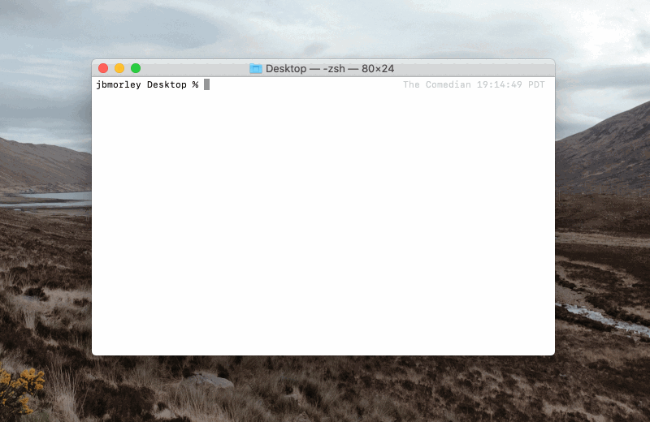

# configure-raspberry-pi

Script to automatically configure a Raspberry Pi boot volume



## Installation

Simply clone the repository:

```bash
git clone git@github.com:jbmorley/configure-raspberry-pi.git
```

You can optionally add it to the path for convenience:

```bash
export PATH=$PATH:~/path/to/configure-raspberry-pi
```

## Usage

```bash
configure-rasbperry-pi
```

The script currently expects to be run on macOS and assumes your Raspberry Pi `boot` partition will be mounted at `/Volumes/boot`. If you're using a different location, or operating system, you can specify this by passing the `--root` flag. For example,

```bash
configure-raspberry-pi --boot /mnt/boot
```

